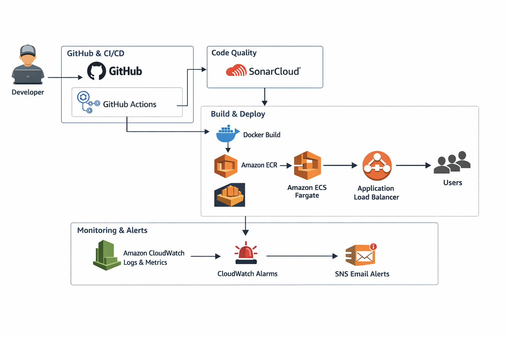

# 🚀 Project 1 – CI/CD Pipeline on AWS ECS

[](https://github.com/elviscalero13/devops-portfolio/actions/workflows/project-1-cicd.yml)

[](https://github.com/elviscalero13/devops-portfolio/actions/workflows/project-1-quality.yml)


## 📌 Overview

This project demonstrates a complete **end-to-end CI/CD pipeline** for a containerized FastAPI application deployed on AWS ECS Fargate.

It includes modern DevOps practices such as:

- Infrastructure as Code using Terraform
- Secure AWS authentication via GitHub OIDC
- Automated container deployment with ECS Fargate
- Code quality analysis using SonarCloud
- Observability with CloudWatch dashboards and alarms
- Alerting via SNS email notifications

---

## 🏗️ Architecture

This architecture illustrates a full CI/CD workflow integrating GitHub Actions, SonarCloud for code quality, AWS ECS for container orchestration, and CloudWatch with SNS for monitoring and alerting.

<p align="center">
  
</p>
---

## 🏗️ Stack

- FastAPI
- Docker
- GitHub Actions (CI/CD)
- Amazon ECR
- Amazon ECS (Fargate)
- Application Load Balancer (ALB)
- Terraform
- SonarCloud
- AWS CloudWatch
- AWS SNS

---

## ⚙️ Features

- End-to-End CI/CD pipeline with GitHub Actions
- Docker image build and push to Amazon ECR
- Automated deployment to ECS Fargate
- Infrastructure fully managed with Terraform
- Static code analysis using SonarCloud
- CloudWatch dashboard for system observability
- CloudWatch alarms for proactive monitoring
- SNS email notifications for incident alerts

---

## 🔁 CI/CD Pipeline

### 1. Quality Pipeline (`project-1-quality.yml`)

- Triggered on pull requests
- Executes:
  - Unit tests
  - Coverage reporting
  - SonarCloud analysis

👉 Ensures code quality before merging

---

### 2. Deployment Pipeline (`project-1-cicd.yml`)

- Triggered on push to `main`
- Executes:
  - Terraform plan & apply
  - Docker build & push to ECR
  - ECS service deployment

---

## 🧪 Code Quality (SonarCloud)

This project integrates **SonarCloud** for continuous code quality inspection.

- Static code analysis
- Code coverage (pytest + coverage)
- Detection of bugs, vulnerabilities, and code smells
- Quality checks executed in CI pipeline

👉 SonarCloud runs automatically on pull requests and helps maintain clean, reliable code.

---

## 📊 Monitoring & Observability

### 📈 CloudWatch Dashboard

A custom CloudWatch dashboard is provisioned using Terraform and includes:

- ECS CPU utilization
- ECS memory utilization
- ALB request count
- ALB response time
- ALB 5XX errors
- Unhealthy targets

👉 Provides real-time visibility into application and infrastructure health.

---

### 🚨 CloudWatch Alarms

The system includes proactive monitoring through alarms:

| Alarm             | Description        |
| ----------------- | ------------------ |
| ECS CPU High      | High CPU usage     |
| ECS Memory High   | High memory usage  |
| ALB 5XX Errors    | Application errors |
| Unhealthy Targets | Failing containers |

👉 Helps detect issues early before impacting users.

---

### 📧 SNS Email Alerts

All CloudWatch alarms are connected to an **Amazon SNS topic**.

- Email notifications are sent when alarms are triggered
- Alerts also notify when systems recover

👉 Enables real-time incident awareness and faster response.

> Note: Email subscription requires manual confirmation.

---

## 🔁 Safe Deployments

This service uses Amazon ECS rolling deployments with deployment circuit breaker enabled.

```hcl
deployment_circuit_breaker {
  enable   = true
  rollback = true
}
```

👉 This ensure that failed deployments are automatically reverted to the last stable version.

---

## ❤️ Health Checks

This project includes dedicated health check endpoints to improve service reliability:

- `/health` → general health check
- `/health/live` → verifies the container is running
- `/health/ready` → verifies the application is ready to serve traffic

These endpoints are used by:
- ECS container health checks
- Application Load Balancer target group health checks

👉 This helps detect failures earlier and supports safer deployments.

---

## ▶️ Run with Docker

```bash
chmod +x scripts/run-docker.sh
./scripts/run-docker.sh
```

---

## 🌐 Endpoints

- `/`
- `/health`
- `/health/live`
- `/health/ready`
- `/version`

---

## 💰 Cost Considerations

- Uses AWS Fargate with minimal resources
- Designed to run at low cost (~$0–$5/month)
- Can be fully removed with:

```bash
terraform destroy
```

---

## 🎯 Project Goals

- Demonstrate a production-style CI/CD pipeline
- Showcase AWS ECS deployment with Terraform
- Implement real-world DevOps practices
- Include observability and alerting
- Maintain a cost-efficient and production-ready setup

---

## 🧠 What This Project Demonstrates

- CI/CD automation with GitHub Actions
- Secure cloud authentication (OIDC)
- Infrastructure as Code (Terraform)
- Container orchestration (ECS)
- Monitoring and alerting (CloudWatch + SNS)
- Code quality practices (SonarCloud integration)

---
