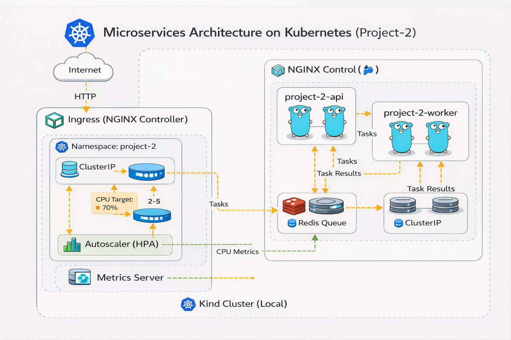

# 🚀 Project 2 – Kubernetes Microservices with HPA & Ingress


---

## 📌 Overview

This project demonstrates a complete **microservices deployment on Kubernetes**, including **automatic scaling, ingress routing, and full environment automation**.

It simulates a production-like Kubernetes setup using **Kind (Kubernetes in Docker)** and applies modern DevOps practices such as:

- Containerized microservices (**Go API + Worker**)
- Kubernetes-based deployments
- Horizontal Pod Autoscaling (HPA)
- Ingress traffic routing
- Metrics-based scaling using Metrics Server
- Full environment automation via scripts

---

## 🏗️ Architecture

This project is based on a Kubernetes microservices architecture composed of:

- API service (Go)
- Worker service (background processing)
- Redis (queue / state)
- NGINX Ingress Controller (entry point)
- Horizontal Pod Autoscaler (HPA)

<p align="center">
  
</p>

---

## 🏗️ Stack

- Kubernetes (Kind)
- Docker
- Go
- Redis
- NGINX Ingress Controller
- Metrics Server
- PowerShell / Bash scripts

---

## ⚙️ Features

- Multi-service architecture (**API + Worker + Redis**)
- Kubernetes Deployments and Services
- Ingress-based external access
- Horizontal Pod Autoscaler (HPA)
- Metrics Server integration
- Fully automated local environment
- Script-driven cluster lifecycle

---

## 🚀 Environment Setup

This project is fully automated and can be started with a single command.

### ▶️ Start everything

```powershell
.\scripts\up.ps1
```

This will:

- Create the Kind cluster
- Install NGINX Ingress Controller
- Install and patch Metrics Server
- Build Docker images
- Load images into the cluster
- Deploy API, Worker, Redis, Ingress, and HPA resources

### 🛑 Destroy environment

```powershell
.\scripts\down.ps1
```

---

## 🌐 Access the Application

Add this entry to your hosts file:

```text
127.0.0.1 project-2.local
```

Then access:

```text
http://project-2.local/
```

---

## 🔁 Kubernetes Resources

### 📦 Deployments

- project-2-api
- project-2-worker
- redis

### 🌐 Services

- ClusterIP → internal communication
- Ingress → external access

### 🌍 Ingress

NGINX Ingress Controller acts as the entry point to the cluster and routes traffic to the API.

---

## 📈 Horizontal Pod Autoscaling (HPA)

The API service is configured with:

- Min replicas: 2
- Max replicas: 5
- CPU target: 70%

Check status:

```bash
kubectl get hpa -n project-2
```

👉 Automatically scales pods based on CPU usage.

---

## 📊 Metrics & Observability

Metrics Server is installed to provide resource usage data required for autoscaling.

Check metrics:

```bash
kubectl top pods -n project-2
```

Used for:

- CPU monitoring
- Resource visibility
- HPA scaling decisions

---

## 🧪 Load Testing (Trigger Autoscaling)

Run a load generator inside the cluster:

```bash
kubectl run load-generator -n project-2 --rm -it --image=busybox -- /bin/sh
```

Inside the pod:

```sh
while true; do wget -q -O- http://project-2-api/; done
```

### 🔍 Observe scaling

```bash
kubectl get hpa -n project-2 -w
kubectl get pods -n project-2 -w
```

👉 You should see replicas increase dynamically under load.

---

## ❤️ System Behavior

The system is designed to:

- Handle concurrent traffic
- Scale horizontally under load
- Maintain service availability
- Separate API requests from background processing (worker pattern)

---

## 💰 Cost Considerations

- Runs locally using Kind → **$0 cost**
- Simulates real production environments
- Easily portable to AWS EKS / GKE / AKS

---

## 🎯 Project Goals

- Demonstrate Kubernetes orchestration skills
- Implement microservices architecture (**API + Worker**)
- Configure autoscaling with HPA
- Use Ingress for routing
- Automate environment setup
- Simulate real-world Kubernetes deployments

---

## 🧠 What This Project Demonstrates

- Kubernetes core concepts (Pods, Deployments, Services)
- Ingress configuration (NGINX)
- Horizontal Pod Autoscaling (HPA)
- Metrics-based scaling
- Local cluster management (Kind)
- DevOps automation via scripts
- Microservices architecture design
- Background processing with API + Worker pattern

---
