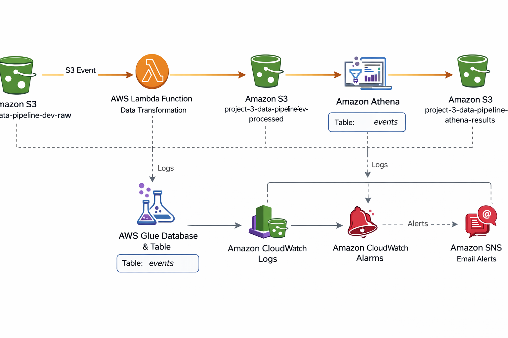

# 🚀 Project 3 – Serverless Data Pipeline on AWS


---

## 📌 Overview

This project demonstrates a **serverless, event-driven data pipeline** built on AWS using Terraform and GitHub Actions.

It processes incoming data automatically and makes it available for analytics using Athena.

The architecture follows modern cloud practices:

* Infrastructure as Code using Terraform (modular design)
* Secure AWS authentication via GitHub OIDC
* Event-driven processing with AWS Lambda
* Data cataloging with AWS Glue
* Querying with Amazon Athena
* Monitoring and alerting using CloudWatch and SNS

---

## 🏗️ Architecture

This architecture represents a fully serverless pipeline where data flows from ingestion to analytics.

<p align="center">
  
</p>

---

## 🏗️ Stack

* AWS S3 (Raw / Processed / Athena results)
* AWS Lambda
* AWS Glue Data Catalog
* Amazon Athena
* AWS CloudWatch
* AWS SNS
* Terraform
* GitHub Actions (CI/CD with OIDC)

---

## ⚙️ Features

* Event-driven data ingestion using S3 triggers
* Automatic data processing via Lambda
* Structured data catalog using AWS Glue
* Queryable datasets using Amazon Athena
* Modular Terraform infrastructure
* Secure CI/CD pipeline with OIDC (no static credentials)
* Monitoring and alerting with CloudWatch and SNS

---

## 🔁 CI/CD Pipeline

### 1. Deployment Pipeline (`project-3-cicd.yml`)

* Triggered on push to `main`
* Executes:

  * Terraform plan
  * Terraform apply
  * Infrastructure provisioning

---

### 2. Destroy Pipeline (`project-3-destroy.yml`)

* Triggered manually
* Executes:

  * Terraform destroy

👉 Allows safe cleanup of all infrastructure

---

## 🔄 Data Flow

1. A file is uploaded to the **raw S3 bucket**
2. S3 triggers a **Lambda function**
3. Lambda processes and transforms the data
4. Output is stored in the **processed S3 bucket**
5. AWS Glue catalogs the dataset
6. Data becomes queryable via **Athena**

---

## 🧪 Testing the Pipeline

### Upload sample data

```bash
aws s3 cp data/sample_events.json s3://<raw-bucket-name>/
```

### Verify

* Lambda execution logs in CloudWatch
* Processed file appears in S3
* Data available in Athena

---

## 🔎 Query Data (Athena)

Example queries:

```sql
SELECT * 
FROM processed_events
LIMIT 10;
```

```sql
SELECT event_type, COUNT(*) AS total
FROM processed_events
GROUP BY event_type
ORDER BY total DESC;
```

```sql
SELECT country, COUNT(*) AS purchases
FROM processed_events
WHERE event_type = 'purchase'
GROUP BY country;
```

---

## 📊 Monitoring & Observability

### 📈 CloudWatch Logs

* Lambda execution logs
* Pipeline activity tracking

---

### 🚨 CloudWatch Alarms

* Monitoring of pipeline execution
* Detection of failures or anomalies

---

### 📧 SNS Alerts

* Email notifications triggered by alarms
* Real-time alerting for issues

👉 Ensures visibility and fast response

---

## 🔐 Security

* Uses GitHub OIDC for AWS authentication
* No static AWS credentials
* IAM roles separated per project
* Least privilege permissions applied

---

## 💰 Cost Considerations

* Fully serverless architecture
* No cost when idle
* Pay only per execution

Estimated idle cost: **~$0/month**

---

## 🎯 Project Goals

* Demonstrate a real-world serverless data pipeline
* Showcase AWS data services integration
* Apply Infrastructure as Code best practices
* Implement secure CI/CD with OIDC
* Enable scalable and cost-efficient data processing

---

## 🧠 What This Project Demonstrates

* Serverless architecture design
* Event-driven data processing
* Terraform modularization
* Secure cloud automation (OIDC)
* Data analytics pipeline (S3 + Glue + Athena)
* Monitoring and alerting (CloudWatch + SNS)

---
